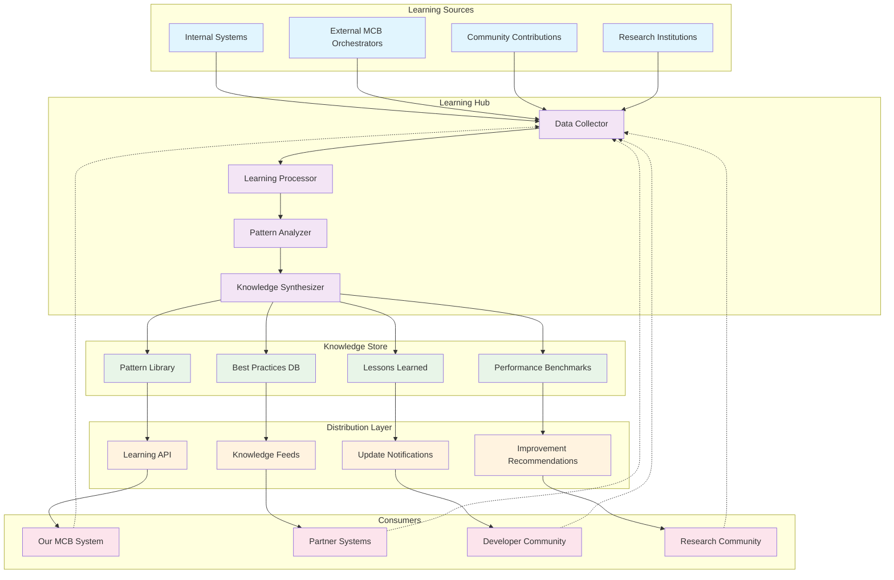

# Shared Learning Framework

## Executive Summary

This document outlines a comprehensive shared learning framework designed to facilitate continuous improvement and knowledge sharing between different MCB orchestrators and AI systems. The framework establishes feedback mechanisms, knowledge exchange protocols, and collaborative improvement processes that benefit the entire ecosystem.

## 1. Shared Learning Architecture

### 1.1 Framework Overview



### 1.2 Learning Framework Components

```python
class SharedLearningFramework:
    def __init__(self):
        self.components = {
            'data_collection': {
                'description': 'Automated collection of learning data from multiple sources',
                'capabilities': [
                    'Performance metrics aggregation',
                    'Error pattern detection',
                    'Usage pattern analysis',
                    'Success story extraction'
                ],
                'data_sources': [
                    'System telemetry',
                    'User feedback',
                    'Performance benchmarks',
                    'Error logs and incidents'
                ]
            },
            'knowledge_processing': {
                'description': 'AI-driven processing and analysis of collected data',
                'techniques': [
                    'Pattern recognition algorithms',
                    'Anomaly detection',
                    'Trend analysis',
                    'Correlation analysis'
                ],
                'outputs': [
                    'Identified patterns',
                    'Performance insights',
                    'Improvement opportunities',
                    'Risk assessments'
                ]
            },
            'knowledge_synthesis': {
                'description': 'Synthesis of insights into actionable knowledge',
                'processes': [
                    'Best practice identification',
                    'Anti-pattern documentation',
                    'Recommendation generation',
                    'Knowledge validation'
                ],
                'quality_assurance': [
                    'Peer review process',
                    'Statistical validation',
                    'Expert verification',
                    'Community feedback'
                ]
            }
        }
```

## 2. Data Collection and Sharing Protocols

### 2.1 Privacy-Preserving Data Collection

```python
class PrivacyPreservingCollector:
    def __init__(self):
        self.privacy_techniques = {
            'differential_privacy': {
                'description': 'Add statistical noise to protect individual data points',
                'implementation': 'Laplace mechanism with configurable epsilon',
                'use_cases': [
                    'Performance metrics aggregation',
                    'Usage pattern analysis',
                    'Error rate statistics'
                ],
                'privacy_guarantee': 'Mathematically proven privacy protection'
            },
            'federated_learning': {
                'description': 'Learn from distributed data without centralization',
                'approach': 'Local model training with gradient sharing',
                'benefits': [
                    'Data remains at source',
                    'Reduced privacy risks',
                    'Scalable learning',
                    'Regulatory compliance'
                ]
            },
            'homomorphic_encryption': {
                'description': 'Compute on encrypted data',
                'applications': [
                    'Encrypted performance comparisons',
                    'Secure benchmarking',
                    'Privacy-preserving analytics'
                ],
                'limitations': [
                    'Computational overhead',
                    'Limited operation types',
                    'Implementation complexity'
                ]
            }
        }
    
    def collect_learning_data(self, data_source, privacy_level='high'):
        """Collect data with appropriate privacy protection"""
        if privacy_level == 'high':
            return self._apply_differential_privacy(data_source)
        elif privacy_level == 'medium':
            return self._apply_aggregation_anonymization(data_source)
        else:
            return self._apply_basic_anonymization(data_source)
```

### 2.2 Data Sharing Standards

```yaml
# Data Sharing Protocol Specification
data_sharing_protocol:
  version: "1.0"
  
  data_categories:
    performance_metrics:
      sharing_level: "aggregated"
      privacy_protection: "differential_privacy"
      update_frequency: "daily"
      retention_period: "1 year"
      
    error_patterns:
      sharing_level: "anonymized"
      privacy_protection: "k_anonymity"
      update_frequency: "real_time"
      retention_period: "2 years"
      
    best_practices:
      sharing_level: "full"
      privacy_protection: "none_required"
      update_frequency: "on_validation"
      retention_period: "indefinite"
      
    usage_patterns:
      sharing_level: "statistical"
      privacy_protection: "differential_privacy"
      update_frequency: "weekly"
      retention_period: "6 months"
  
  data_formats:
    metrics:
      format: "JSON"
      schema: "metrics_v1.json"
      compression: "gzip"
      encryption: "AES-256"
      
    patterns:
      format: "YAML"
      schema: "patterns_v1.yaml"
      validation: "JSON Schema"
      signing: "digital_signature"
  
  quality_requirements:
    completeness: "> 95%"
    accuracy: "> 99%"
    timeliness: "< 1 hour delay"
    consistency: "schema_validated"
```

## 3. Knowledge Exchange Mechanisms

### 3.1 Automated Knowledge Exchange

```python
class KnowledgeExchangeEngine:
    def __init__(self):
        self.exchange_mechanisms = {
            'pattern_sharing': {
                'description': 'Automated sharing of identified patterns',
                'process': [
                    'Pattern detection in local system',
                    'Pattern validation and scoring',
                    'Privacy-preserving pattern encoding',
                    'Distribution to network participants'
                ],
                'pattern_types': [
                    'Performance optimization patterns',
                    'Error recovery patterns',
                    'Scaling patterns',
                    'Integration patterns'
                ]
            },
            'benchmark_sharing': {
                'description': 'Collaborative benchmarking across systems',
                'methodology': [
                    'Standardized benchmark definitions',
                    'Automated benchmark execution',
                    'Results aggregation and analysis',
                    'Comparative performance insights'
                ],
                'benchmark_categories': [
                    'Throughput benchmarks',
                    'Latency benchmarks',
                    'Resource utilization benchmarks',
                    'Scalability benchmarks'
                ]
            },
            'improvement_recommendations': {
                'description': 'AI-generated improvement suggestions',
                'generation_process': [
                    'Performance gap analysis',
                    'Best practice matching',
                    'Contextual recommendation generation',
                    'Impact prediction and prioritization'
                ],
                'recommendation_types': [
                    'Configuration optimizations',
                    'Architecture improvements',
                    'Process enhancements',
                    'Tool recommendations'
                ]
            }
        }
    
    def generate_knowledge_exchange(self, local_data, network_knowledge):
        """Generate knowledge exchange based on local and network data"""
        patterns = self._identify_shareable_patterns(local_data)
        benchmarks = self._generate_benchmark_results(local_data)
        recommendations = self._generate_recommendations(local_data, network_knowledge)
        
        return {
            'patterns': patterns,
            'benchmarks': benchmarks,
            'recommendations': recommendations,
            'timestamp': datetime.now(),
            'source_system': self.system_id
        }
```

### 3.2 Community-Driven Knowledge Curation

```yaml
# Community Knowledge Curation Framework
community_curation:
  governance_model:
    structure: "meritocratic"
    roles:
      contributors:
        requirements: "Active system usage"
        permissions: ["submit_knowledge", "vote_on_submissions"]
        
      reviewers:
        requirements: "Demonstrated expertise + community trust"
        permissions: ["review_submissions", "approve_knowledge", "mentor_contributors"]
        
      maintainers:
        requirements: "Long-term contribution + technical leadership"
        permissions: ["manage_categories", "resolve_disputes", "set_standards"]
        
      council:
        requirements: "Elected by community"
        permissions: ["strategic_decisions", "policy_changes", "conflict_resolution"]
  
  knowledge_lifecycle:
    submission:
      process: "Community member submits knowledge item"
      requirements: ["clear_description", "supporting_evidence", "test_cases"]
      
    review:
      process: "Peer review by qualified reviewers"
      criteria: ["accuracy", "relevance", "clarity", "completeness"]
      timeline: "7 days maximum"
      
    validation:
      process: "Automated and manual validation"
      tests: ["technical_validation", "performance_impact", "security_review"]
      
    approval:
      process: "Final approval by maintainers"
      criteria: ["community_consensus", "quality_standards", "strategic_alignment"]
      
    publication:
      process: "Knowledge item added to shared repository"
      distribution: ["api_endpoints", "notification_feeds", "documentation_updates"]
  
  quality_assurance:
    peer_review:
      minimum_reviewers: 3
      reviewer_qualifications: "Domain expertise + system experience"
      review_criteria: "Technical accuracy, practical applicability, clarity"
      
    automated_validation:
      syntax_checking: "Automated format and schema validation"
      performance_testing: "Automated performance impact assessment"
      security_scanning: "Automated security vulnerability detection"
      
    community_feedback:
      rating_system: "5-star rating with detailed feedback"
      usage_tracking: "Track adoption and success rates"
      continuous_improvement: "Regular review and updates based on feedback"
```

## 4. Collaborative Improvement Processes

### 4.1 Cross-System Learning Initiatives

```python
class CrossSystemLearning:
    def __init__(self):
        self.learning_initiatives = {
            'performance_optimization_challenges': {
                'description': 'Collaborative challenges to optimize specific performance metrics',
                'structure': {
                    'challenge_definition': 'Community defines optimization target',
                    'participation': 'Multiple systems contribute solutions',
                    'evaluation': 'Standardized benchmarking and evaluation',
                    'knowledge_sharing': 'Winning solutions shared with community'
                },
                'example_challenges': [
                    'Reduce cold start latency by 50%',
                    'Improve concurrent request handling by 30%',
                    'Optimize memory usage for large knowledge bases',
                    'Enhance error recovery time'
                ]
            },
            'joint_research_projects': {
                'description': 'Collaborative research on common challenges',
                'project_types': [
                    'Algorithm development',
                    'Architecture patterns',
                    'Performance optimization',
                    'Security enhancements'
                ],
                'collaboration_model': [
                    'Shared research goals',
                    'Distributed experimentation',
                    'Regular progress sharing',
                    'Joint publication of results'
                ]
            },
            'interoperability_initiatives': {
                'description': 'Projects to improve system interoperability',
                'focus_areas': [
                    'Standard API development',
                    'Data format standardization',
                    'Protocol harmonization',
                    'Integration pattern sharing'
                ],
                'deliverables': [
                    'Interoperability standards',
                    'Reference implementations',
                    'Compatibility testing suites',
                    'Migration tools'
                ]
            }
        }
    
    def initiate_learning_project(self, project_type, participants, objectives):
        """Initiate a cross-system learning project"""
        project = {
            'id': self._generate_project_id(),
            'type': project_type,
            'participants': participants,
            'objectives': objectives,
            'timeline': self._generate_timeline(objectives),
            'milestones': self._define_milestones(objectives),
            'success_metrics': self._define_success_metrics(objectives),
            'collaboration_tools': self._setup_collaboration_tools(),
            'knowledge_sharing_plan': self._create_sharing_plan()
        }
        return project
```

### 4.2 Continuous Improvement Feedback Loops

```yaml
# Continuous Improvement Framework
continuous_improvement:
  feedback_collection:
    automated_metrics:
      collection_frequency: "real_time"
      metrics_types:
        - "performance_metrics"
        - "error_rates"
        - "user_satisfaction"
        - "resource_utilization"
      
    user_feedback:
      collection_methods:
        - "in_app_feedback_forms"
        - "periodic_surveys"
        - "user_interviews"
        - "community_forums"
      
    system_feedback:
      monitoring_systems:
        - "application_performance_monitoring"
        - "infrastructure_monitoring"
        - "business_metrics_tracking"
        - "security_event_monitoring"
  
  analysis_and_insights:
    automated_analysis:
      techniques:
        - "trend_analysis"
        - "anomaly_detection"
        - "correlation_analysis"
        - "predictive_modeling"
      
    human_analysis:
      processes:
        - "expert_review_sessions"
        - "cross_functional_analysis"
        - "customer_journey_mapping"
        - "root_cause_analysis"
      
    insight_synthesis:
      methods:
        - "data_triangulation"
        - "pattern_recognition"
        - "hypothesis_generation"
        - "impact_assessment"
  
  improvement_implementation:
    prioritization:
      criteria:
        - "user_impact"
        - "business_value"
        - "implementation_effort"
        - "risk_assessment"
      
    experimentation:
      approach: "hypothesis_driven_experimentation"
      methods:
        - "a_b_testing"
        - "canary_deployments"
        - "feature_flags"
        - "controlled_rollouts"
      
    measurement:
      success_metrics:
        - "performance_improvements"
        - "user_satisfaction_increases"
        - "error_rate_reductions"
        - "efficiency_gains"
```

## 5. Knowledge Validation and Quality Assurance

### 5.1 Multi-Stage Validation Process

```python
class KnowledgeValidator:
    def __init__(self):
        self.validation_stages = {
            'technical_validation': {
                'description': 'Automated technical correctness validation',
                'checks': [
                    'Syntax and format validation',
                    'Schema compliance verification',
                    'Logical consistency checking',
                    'Performance impact assessment'
                ],
                'tools': [
                    'Static analysis tools',
                    'Schema validators',
                    'Logic analyzers',
                    'Performance profilers'
                ]
            },
            'peer_review': {
                'description': 'Expert peer review process',
                'process': [
                    'Reviewer assignment based on expertise',
                    'Structured review using standardized criteria',
                    'Collaborative review discussion',
                    'Consensus building on acceptance'
                ],
                'criteria': [
                    'Technical accuracy',
                    'Practical applicability',
                    'Clarity and completeness',
                    'Innovation and value'
                ]
            },
            'empirical_validation': {
                'description': 'Real-world testing and validation',
                'methods': [
                    'Controlled experiments',
                    'A/B testing',
                    'Performance benchmarking',
                    'User acceptance testing'
                ],
                'metrics': [
                    'Performance improvements',
                    'Error rate reductions',
                    'User satisfaction scores',
                    'Adoption rates'
                ]
            },
            'community_validation': {
                'description': 'Community-based validation and feedback',
                'mechanisms': [
                    'Community voting',
                    'Usage tracking',
                    'Feedback collection',
                    'Success story documentation'
                ],
                'quality_indicators': [
                    'Community adoption rate',
                    'Positive feedback ratio',
                    'Successful implementation cases',
                    'Long-term usage patterns'
                ]
            }
        }
    
    def validate_knowledge_item(self, knowledge_item):
        """Comprehensive validation of knowledge items"""
        validation_results = {}
        
        for stage, config in self.validation_stages.items():
            stage_result = self._execute_validation_stage(knowledge_item, stage, config)
            validation_results[stage] = stage_result
        
        overall_score = self._calculate_overall_score(validation_results)
        recommendation = self._generate_recommendation(overall_score, validation_results)
        
        return {
            'overall_score': overall_score,
            'stage_results': validation_results,
            'recommendation': recommendation,
            'validation_timestamp': datetime.now()
        }
```

### 5.2 Quality Metrics and Scoring

```yaml
# Knowledge Quality Scoring Framework
quality_scoring:
  scoring_dimensions:
    technical_quality:
      weight: 0.3
      sub_metrics:
        accuracy: 0.4
        completeness: 0.3
        consistency: 0.3
      
    practical_value:
      weight: 0.25
      sub_metrics:
        applicability: 0.4
        impact_potential: 0.35
        implementation_ease: 0.25
      
    clarity_and_documentation:
      weight: 0.2
      sub_metrics:
        clarity: 0.4
        documentation_quality: 0.35
        examples_quality: 0.25
      
    community_validation:
      weight: 0.15
      sub_metrics:
        peer_review_scores: 0.4
        adoption_rate: 0.35
        user_feedback: 0.25
      
    innovation_factor:
      weight: 0.1
      sub_metrics:
        novelty: 0.5
        breakthrough_potential: 0.3
        competitive_advantage: 0.2
  
  scoring_scale:
    excellent: 4.5 - 5.0
    very_good: 3.5 - 4.4
    good: 2.5 - 3.4
    fair: 1.5 - 2.4
    poor: 0.0 - 1.4
  
  quality_thresholds:
    publication_threshold: 3.0
    featured_content_threshold: 4.0
    best_practice_threshold: 4.5
    
  continuous_monitoring:
    re_evaluation_triggers:
      - "significant_usage_data_available"
      - "community_feedback_threshold_reached"
      - "performance_impact_data_collected"
      - "competitive_landscape_changes"
    
    quality_degradation_detection:
      - "declining_adoption_rates"
      - "increasing_negative_feedback"
      - "performance_regression_reports"
      - "outdated_information_flags"
```

## 6. Learning Analytics and Insights

### 6.1 Learning Effectiveness Measurement

```python
class LearningAnalytics:
    def __init__(self):
        self.analytics_framework = {
            'knowledge_adoption_metrics': {
                'description': 'Measure how effectively knowledge is adopted',
                'metrics': [
                    'Knowledge item download/access rates',
                    'Implementation success rates',
                    'Time to implementation',
                    'Performance improvement achieved'
                ],
                'analysis_methods': [
                    'Adoption curve analysis',
                    'Success factor identification',
                    'Barrier analysis',
                    'ROI calculation'
                ]
            },
            'learning_velocity_metrics': {
                'description': 'Measure speed of learning and improvement',
                'metrics': [
                    'Time from problem identification to solution',
                    'Knowledge creation and validation speed',
                    'Community response time',
                    'Implementation cycle time'
                ],
                'benchmarks': [
                    'Industry standard comparison',
                    'Historical performance trends',
                    'Peer system comparisons',
                    'Best-in-class targets'
                ]
            },
            'knowledge_quality_evolution': {
                'description': 'Track quality improvements over time',
                'tracking_dimensions': [
                    'Technical accuracy improvements',
                    'Practical applicability enhancements',
                    'Documentation quality evolution',
                    'Community satisfaction trends'
                ],
                'analysis_techniques': [
                    'Longitudinal analysis',
                    'Quality trend identification',
                    'Improvement driver analysis',
                    'Predictive quality modeling'
                ]
            }
        }
    
    def generate_learning_insights(self, analytics_data):
        """Generate actionable insights from learning analytics"""
        insights = {
            'adoption_insights': self._analyze_adoption_patterns(analytics_data),
            'velocity_insights': self._analyze_learning_velocity(analytics_data),
            'quality_insights': self._analyze_quality_trends(analytics_data),
            'improvement_opportunities': self._identify_improvement_opportunities(analytics_data),
            'success_factors': self._identify_success_factors(analytics_data)
        }
        return insights
```

### 6.2 Predictive Learning Models

```yaml
# Predictive Learning Models
predictive_models:
  knowledge_demand_prediction:
    description: "Predict future knowledge needs based on trends"
    input_features:
      - "current_system_performance_gaps"
      - "emerging_technology_trends"
      - "community_discussion_topics"
      - "error_pattern_evolution"
    
    model_types:
      - "time_series_forecasting"
      - "topic_modeling"
      - "trend_analysis"
      - "anomaly_prediction"
    
    outputs:
      - "predicted_knowledge_gaps"
      - "priority_research_areas"
      - "resource_allocation_recommendations"
      - "proactive_learning_initiatives"
  
  learning_success_prediction:
    description: "Predict likelihood of successful knowledge adoption"
    input_features:
      - "knowledge_complexity_score"
      - "implementation_effort_estimate"
      - "community_readiness_indicators"
      - "historical_adoption_patterns"
    
    prediction_targets:
      - "adoption_probability"
      - "implementation_success_rate"
      - "time_to_adoption"
      - "performance_improvement_potential"
    
    model_applications:
      - "knowledge_prioritization"
      - "resource_allocation"
      - "community_preparation"
      - "success_optimization"
  
  quality_evolution_prediction:
    description: "Predict how knowledge quality will evolve"
    factors:
      - "community_engagement_levels"
      - "validation_process_effectiveness"
      - "feedback_quality_and_volume"
      - "maintenance_resource_availability"
    
    predictions:
      - "quality_improvement_trajectory"
      - "maintenance_needs_forecast"
      - "obsolescence_risk_assessment"
      - "refresh_timing_recommendations"
```

## 7. Implementation Roadmap

### 7.1 Phase 1: Foundation (Months 1-3)

```python
phase_1_implementation = {
    'core_infrastructure': {
        'timeline': '3 months',
        'deliverables': [
            'Learning data collection framework',
            'Privacy-preserving data sharing protocols',
            'Basic knowledge validation system',
            'Community platform setup'
        ],
        'success_criteria': [
            'Data collection from 5+ systems',
            'Privacy compliance certification',
            'Basic validation pipeline operational',
            'Community platform with 100+ members'
        ]
    },
    'initial_knowledge_base': {
        'timeline': '2 months',
        'deliverables': [
            'Performance optimization patterns library',
            'Common error resolution patterns',
            'Best practices documentation',
            'Initial benchmark suite'
        ],
        'success_criteria': [
            '50+ validated knowledge items',
            '90%+ validation success rate',
            'Community contribution rate > 10 items/month',
            'Knowledge adoption rate > 60%'
        ]
    }
}
```

### 7.2 Phase 2: Expansion (Months 4-8)

```yaml
phase_2_expansion:
  advanced_analytics:
    timeline: "4 months"
    components:
      - "Learning effectiveness measurement system"
      - "Predictive learning models"
      - "Advanced quality scoring algorithms"
      - "Automated insight generation"
    
    targets:
      - "Predictive accuracy > 80%"
      - "Insight generation latency < 1 hour"
      - "Quality scoring precision > 95%"
      - "Analytics dashboard adoption > 70%"
  
  cross_system_collaboration:
    timeline: "5 months"
    initiatives:
      - "Multi-system performance challenges"
      - "Joint research project framework"
      - "Interoperability standards development"
      - "Collaborative improvement processes"
    
    success_metrics:
      - "10+ participating systems"
      - "5+ active collaboration projects"
      - "Interoperability standard adoption > 50%"
      - "Cross-system knowledge sharing > 100 items/month"
```

### 7.3 Phase 3: Optimization (Months 9-12)

```python
phase_3_optimization = {
    'ai_enhanced_learning': {
        'timeline': '4 months',
        'features': [
            'AI-powered knowledge curation',
            'Automated quality assessment',
            'Intelligent recommendation systems',
            'Predictive maintenance for knowledge base'
        ],
        'performance_targets': [
            'Curation accuracy > 95%',
            'Recommendation relevance > 90%',
            'Knowledge freshness score > 85%',
            'Automated processing > 80% of submissions'
        ]
    },
    'ecosystem_maturity': {
        'timeline': '6 months',
        'objectives': [
            'Self-sustaining community governance',
            'Industry standard establishment',
            'Academic research partnerships',
            'Commercial ecosystem development'
        ],
        'success_indicators': [
            'Community self-governance operational',
            'Industry standard adoption > 30%',
            '5+ academic partnerships established',
            'Commercial marketplace launched'
        ]
    }
}
```

## 8. Success Metrics and KPIs

### 8.1 Learning Effectiveness KPIs

```yaml
learning_effectiveness_kpis:
  knowledge_creation:
    knowledge_items_created_per_month: 
      target: 100
      current: 45
      trend: "increasing"
    
    validation_success_rate:
      target: 95%
      current: 87%
      trend: "stable"
    
    time_to_validation:
      target: "< 7 days"
      current: "9.5 days"
      trend: "improving"
  
  knowledge_adoption:
    adoption_rate:
      target: 75%
      current: 62%
      trend: "increasing"
    
    implementation_success_rate:
      target: 85%
      current: 78%
      trend: "stable"
    
    time_to_implementation:
      target: "
