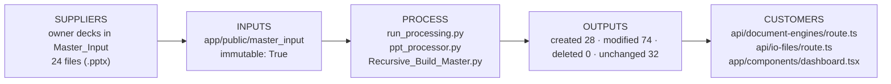
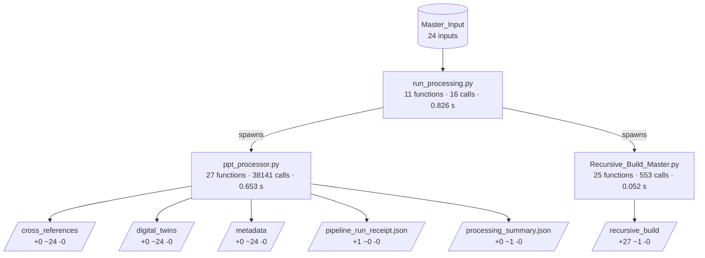
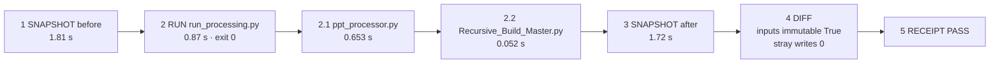

# Master_Input pipeline run: SIPOC, DAG, SPINE

## SIPOC

```mermaid
flowchart LR
  S["SUPPLIERS<br/>owner decks in Master_Input<br/>24 files (.pptx)"]
  I["INPUTS<br/>app/public/master_input<br/>immutable: True"]
  P["PROCESS<br/>run_processing.py<br/>ppt_processor.py<br/>Recursive_Build_Master.py"]
  O["OUTPUTS<br/>created 28 · modified 74 · deleted 0 · unchanged 32"]
  C["CUSTOMERS<br/>api/document-engines/route.ts<br/>api/io-files/route.ts<br/>app/components/dashboard.tsx"]
  S --> I --> P --> O --> C
```

## Process / output DAG

```mermaid
flowchart TD
  IN[("Master_Input<br/>24 inputs")]
  P519["run_processing.py<br/>11 functions · 16 calls · 0.826 s"]
  P520["ppt_processor.py<br/>27 functions · 38141 calls · 0.653 s"]
  P521["Recursive_Build_Master.py<br/>25 functions · 553 calls · 0.052 s"]
  IN --> P519
  P519 -->|spawns| P520
  P519 -->|spawns| P521
  O_cross_references[/"cross_references<br/>+0 ~24 -0"/]
  P520 --> O_cross_references
  O_digital_twins[/"digital_twins<br/>+0 ~24 -0"/]
  P520 --> O_digital_twins
  O_metadata[/"metadata<br/>+0 ~24 -0"/]
  P520 --> O_metadata
  O_pipeline_run_receipt_json[/"pipeline_run_receipt.json<br/>+1 ~0 -0"/]
  P520 --> O_pipeline_run_receipt_json
  O_processing_summary_json[/"processing_summary.json<br/>+0 ~1 -0"/]
  P520 --> O_processing_summary_json
  O_recursive_build[/"recursive_build<br/>+27 ~1 -0"/]
  P521 --> O_recursive_build
```

## Run SPINE

```mermaid
flowchart LR
  A["1 SNAPSHOT before<br/>1.81 s"] --> B["2 RUN run_processing.py<br/>0.87 s · exit 0"]
  B --> B1["2.1 ppt_processor.py<br/>0.653 s"]
  B1 --> B2["2.2 Recursive_Build_Master.py<br/>0.052 s"]
  B2 --> C["3 SNAPSHOT after<br/>1.72 s"]
  C --> D["4 DIFF<br/>inputs immutable True<br/>stray writes 0"]
  D --> E["5 RECEIPT PASS"]
```

